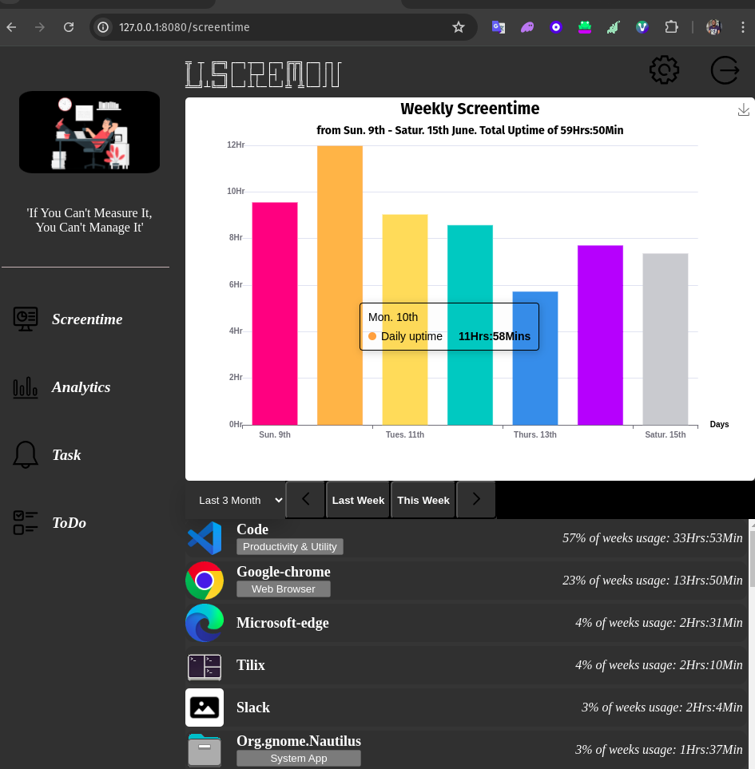
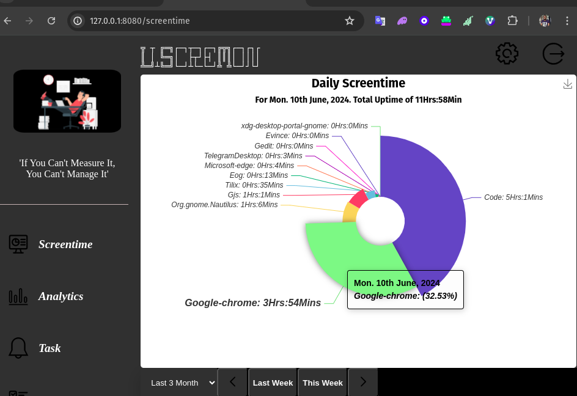

# SCREEN MONITOR

## Liscremon

Liscremon, Linux Screen Monitor, is the linux specific distribution of this project, all intention is to make this available on [Windows](https://en.wikipedia.org/wiki/Microsoft_Windows) and [MacOS](https://en.wikipedia.org/wiki/MacOS). It's Linux for now, because it is the development environment I use. I own a banged-up HP Pavilion, so Windows support is definately coming(WinScreMon). I can't say much of MacOS(DaScreMon), shit is too expensive. After the first developer release, support for windows is my next to-do.

This README.md is meant to invite contributions to the project, I believe am working too slow on it, also because I just want more opinions on the features that would be useful (building in secret is not so much fun as I thought). So, if you want to touch grass with this codebase, THANK YOU 🙌🏿🙌🏿🙌🏿 and here are the things you should know.

## Project Scope:

The suitable name for this project is something like a 'screen monitor' without any operating system name attached. The central feature is to monitor **desktop screentime and application usage** something like the iOS screentime in the iPhone Settings or projects like [ActivityWatch](https://activitywatch.net/), [RescueTime](https://www.rescuetime.com/), [ManicTime](https://www.manictime.com/) or [WakaTime](https://wakatime.com/).

The plan is to follow more on the path with ActivityWatch, but in [Go](https://go.dev/), ActivityWatch is built with [Python](https://www.python.org/), with plans to rewrite some part of it in [Rust](https://www.rust-lang.org/).

So far on this project, the central feature is available;

> **Screentime**

    

        Weekly Screentime
    

    

    

        Daily Screentime, on clicking on any of the weekly bar
    

    

    

        Application Screentime for the week
    

    

As for me, this page, the 'Sceentime', is completed. I said as for me, so other new ideas are welcomed, to add or teardown. The other features as noticed from the menu bar includes;

[implementation details is discussed below]().

> **Tasks**

The third option on the left menu, is meant to consist of a 'Reminder' and 'Daily App Limit'. Both of this feauture would be availabe in the first developer release (functional but the UI is very shitty). Sounds cool but not central to the scope of the project.

The **Reminder system** is just something that sends a desktop notification, with or without sound, as created for a task by the user, with two pre-notification, also with an option to launch an the app on _StartTime_. Everything here is up for debate but I believe these are sane defaults.

[implementation details is discussed below]()

The **Daily App Limit** is also a notification that tells you when your usage for a particular application is reached for a day, also with the option to exist the app on limit reached.

[implementation details is discussed below]().

> **Analytics**

This feature, unlike _Tasks_, is central to the application, it like a secondary feature to _Screentime_. This is where you can do advance analytics on your screentime data aside "weekly". A month screentime, a 3 week application screentime, in Line plot or whatever is fine presentation for such data. If you take a closer look at the "Weekly Screentime" image shared above, you would notice under the name of some application, a categorization exist, we can have analytics that make use of this categorization. Something like, a two week usage analytics with application categorized under "Entertainment and Gaming".

This part should be fun, ActivityWatch has something like that, it is called "Query" or something. On the discussion regarding Application Category, [see here](). This part, in my intention might not be available on the first developer release. Opinions on how this should be implemented and presented is what am looking forward too.

> **ToDo**

This one, not central at all, is the last thing we should handle if we agree it is "Okay" to have. The idea is to have a UI like the mobile app version of [Trello](https://trello.com/), where we have three columns; "ToDo", "Doing" and "Done"; with drag and drop. Ideally Todo items should be limited to two weeks. Seeing we have a Reminder system already, it would only be frontend heavy,and just few rewiring on the Go side of things.

## Project Architecture

I cannot think of a better way to introduce the project codebase other than it folder structure, it actually a Go thing...it module and package management system, which is very good;

- **cli/ & daemon/**: This is the **daemon service**, like every cobra-cli app, it has a main.go file (the entrypoint) and a cli/ folder which house the commands. The commands in the cli/ folder are just to start and stop the _daemon_. The deamon/ folder house the daemon functionalities; the screen monitoring, task scheduling and database management. It is always running, so it has an autostart script. Compiled at the root of the project directory, produces the **smDaemon binary**.

- **agent/**: This is the backend that talks to the daemon service, and also contains the frontend that displays to the user. It houses the webserver app struct and the frontend codebase; the htmx, templ, tailwind and static files. It is just a package with two public function.

- **browser/**: This renders the frontend via the browser, it contains the **webserver** and imports _agent/_.It is a module and produces the **smBrowser** binary.

- **desktop/**: This renders the frontend via the **wails desktop app**, it contains the setup for the wails app and imports _agent/_. It is a module and produces the **smDesktop** binary.

- **TrayIcon**: This is meant to be another way the user can interacts with the application, aside the desktop entry for the desktop app. See the image below. It is a module and produces the **smTrayIcon** binary.
  

  

  tray-Icon
  

  
  

- **utils/**: This standalone module contains shared functions and Types for other mdoules.

## Installation

Since this is a developer-release, you need to clone the project first. In the root directory, run;

> `make all`

This would run a dependencies-check first, if all is fufilled, it then compiles all four binaries. It would also place the binaries in your `GOPATH/bin` directory and add to two .desktop file to your `~/.config/autostart` for the `daemon and the tray-Icon`.

## Development

If you want to contribute or run these programs yourself, here is a good guide;

- get something like Tilix that can help you split your terminal, cos you'll need to open about 5 of it 😄😄😄

- firstly, in the project root directory, run;

  > `make dev`

  to start the daemon service, this has to be running before others. This would actually try to kill other daemon process running, and also enable printing to the terminal

- if you would be working on the `browser/`, `desktop/` or `trayIcon`, open a terminal for them and also run;

  > `make dev`

  this would likewise enable printing to the terminal.

- if you are going to be making changes to the frontend, you'll need to open two terminal for live reload and updates. `cd` into `agent/internal/frontend`, run:

  > `make tailwindcss`

  this would enable live reload for the tailwindcss ouput file.

  > `make dev`

  this would enable templ hot reload.

## Contribution guide

### Note

Thanks for doing this, before you proceed I'll recommend seeing the Project scope, the architecture and development. This project is birth in the spirit of Go as the backend language, it employs HMTX, a-h Templ, Hyperscript and Tailwindcss for it frontend. I believe with this stack we can complete this project, if need requires...maybe AlpineJS but not React or any other over-powerful JS framework.
You can pick up any part of the projects and make your contribution(s).

### Other things I want to say

- Why Go?

  Go **simplicity**, **superb performance** and **EXPLICIT-ness** makes it my love-language. It is the perfect balance between *low performance, extremely simple **Python*** to *high performance, pain-in-the-ass **Rust***. It is the better brother of [Java](https://www.java.com/en/download/help/whatis_java.html), the true prodigy of [C](<https://en.wikipedia.org/wiki/C_(programming_language)>), the final blessing of software development for [grug brain developers](https://grugbrain.dev/) and the "Q.E.D" (Quite Easyily Done) of professional software development.

- Why HTMX?

  For me, argubaly the best software principle is ["Locality of Behaviour"](https://htmx.org/essays/locality-of-behaviour/) and HTMX does it better, coupled with [Hyperscript](https://hyperscript.org/) & [Tailwindcss](https://tailwindcss.com/), 😘😘😘. Also, [Vue.js](https://vuejs.org/), [Svelte](https://svelte.dev/) and other supposedly said simple altervenatives...seems hard, I'm a backend guy.

## Other Code discussions:

- **Protobuf** is included in the codebase, but we'll use it later in development once we're confident in our type definitions. Since frequent serialization/deserialization will occur at every user window switch, Protobuf offers better performance and storage efficiency. However, we're currently using JSON for ease of development.

- **Active and passive screentime**, it you peruse the codebase regarding screen monitoring, you'll notice a distinction in the screentime recorded. The idea of a **active screentime** is the window with the active focus & **passive screentime** includes windows that aren't in focus but are still interacted with, like scrolling on a webpage while focused on another window _(two-hand scrolling)_, or those that remain visible in a split screen. These nuances are still under consideration. I tried working on the two-hand scrolling feature, but it proved too machine-dependent, requiring mouse-driver interfacing _(I forsee writing C code here)_. For window visibility, with the help of a C++ friend, we were able to capture that metric, though it brings its own set of debates, such as how large must a non-overlaped window be to be regarded as still in passive use; especially when you consider big screens.
  It would be nice capturing this metrics as a screentime record but...it is too opinionated; I'll rather we discuss it before implementing and removing later.

- **Browser watch history**, ActivityWatch includes this feature, so maybe we should consider adding it as well. What are your thoughts?

- **Application Logo**, that was the best I could get from BingAI, I cannot even remember what the prompt was but if you think that logo is terrible; I agree and we should change it.

I don't have anything else reasonable to say, so please I'll be expecting your feedback on my hands with Go, thanks. Very strong criticism are the most welcomed.
